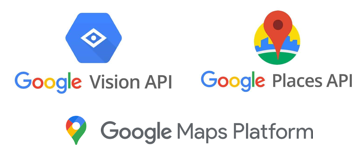
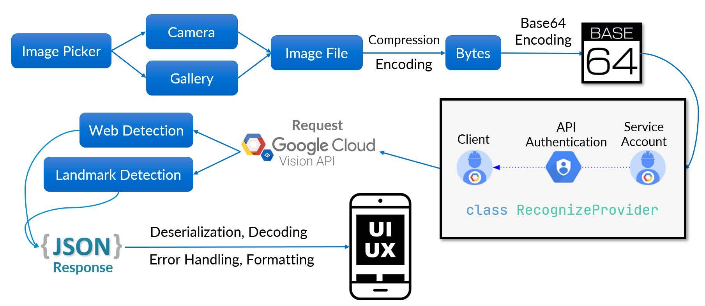

# Travelee

#### *Your next-generation tour guide, Your trustable travel assistant.*

This is the code repository for my final year project (FYP) in Nanyang Technological University. The project is named "Next-Generation Tour Guide - an AR Travel Assistant". It is a full-stack mobile application development project, which is expected to design and develop an Android application to create a modern travel experience for travelers by applying some advanced technologies.

The total duration of this final year project is around 10 months, starting from the mid of August, 2021, whereas the whole development process starts from mid of September, 2021. It is expected to be fully completed by March.

## Significance of this Project
<li>Identify some inconveniences and pains encountered by today's travellers</li>
<li>Discover the potential technologies that may help enhance the current travel experience</li>
<li>Develop a mobile app to introduce a modern travel experience and demonstrate a vision for future travel</li>

## About Travelee

#### <u>Why named *Travelee*?</u>

*The suffix* **-er** *is used to describe a person or thing that does or provides an action.*

*The suffix* **-ee** *describes the person or thing that receives the action.*

- **Traveler** - a person who travels
- **Travelee** – the thing receives the action => travelling

#### <u>Target users</u>
Whether you are a traveler who has just arrived in Singapore, or a traveler who is already here but wants to explore or **rediscover Singapore**. You will need and feel interested in our products.

#### <u>Product Positioning</u>

- **A smart travel assistant** who always is ready to provide travellers with what they need right at their fingertips.
- **A reliable companion** who can help travellers navigate their neighbourhood easily and travel with confidence with the presence of Travelee
s
- **A local culture ambassador** who aims to promote local tourism and introduce local culture to global travellers

#### <u>Our Objectives</u>

- Use modern technology to enhance the current travel experience.

- Help travellers better explore the city and discover popular places nearby.

- Present travel-related information in a more intuitive way.

- Offer travellers necessary and convenient tools.

## Highlights

### **Live View AR Experience**

Augmented Reality (AR) is used here to enhance the view of your surroundings! Simply Use your phone’s camera to **unlock a new way of exploring nearby places!**

- [x] Places are displayed as virtual signs in all directions of the camera view
- [x] **Get live distances and useful information** for each place with just one click!
- [x] **Support 3 predefined categories:** shopping centres, MRT stations, tourist attractions
- [x] **Flexible distance filtering:** Avoid places flooding!
- [x] [NEW!] Support user-customized places. Add and view any place you care about! (Preview)
- [x] [NEW!] Support multi-user real-time location tracking with AR enabled. Location sharing within your tour group! (Preview)

**AR SDK resource:**

**Data resource:**

- MRT stations: https://en.wikipedia.org/wiki/List_of_Singapore_MRT_stations
- Shopping centres: https://en.wikipedia.org/wiki/List_of_shopping_malls_in_Singapore
- Tourist attractions: https://data.gov.sg/dataset/tourist-attractions
- Coordinate service: https://www.onemap.gov.sg/docs/

### **Landmark Detection**

This intelligent detection leverages the power of Google AI Cloud and its powerful pretrained ML model. In short, **search whatever you see!**

- [x] **Recognise landmarks** **around the world** from camera/your gallery, and get the result within 3 seconds!
- [x] **Robust detection:** The detection works best if it's a well-known landscape. Even it's not a landmark, we will still try to provide our best guessed result using web detection.
- [x] **Aesthetic and easy-to-use UI:** Seamless photo upload process, intuitive result presentation and useful discovery tools.

**API resource:**

### **Place Recommendation**

- [x] **Get real-time recommendation** on interesting places nearby, e.g., activities, landmarks, restaurants
- [x] **Automatic notification push:** Travelee will notify you if
  - if you are close to one of popular landmarks
  - if you’ve made your way to the destination

- [x] **Automatic recommendation push:** recommend popular places nearby occasionally

**Data resource:**

- Activities: https://kampung-api.herokuapp.com/attractions/ *[Source: Goh Zong Han]*
- Landmarks: https://data.gov.sg/dataset/tourist-attractions
- Restaurants: https://rapidapi.com/apidojo/api/travel-advisor/

### **Convenient Travel Service**

- [x] **Weather info:** Get the latest weather conditions based on the user's location
- [x] **COVID-19 Support:** Travel safely and confidently with one-click access to latest local COVID-19 situation and safety information

### **Achievement System (Preview)**

- [x] [NEW!] **Achievement Scoreboard** Keep track of the number of places, cities you've been to and badges collected so far
- [x] [NEW!] **Badge Collection** Display your collection of badges, including achievement tasks and visited cities
- [x] [NEW!] **Rewards Claiming** Claim rewards by scanning landmarks directly

**API resource:**

- Weather data: https://openweathermap.org/api
- COVID-19 support: [disease.sh - Open Disease Data API](https://corona.lmao.ninja/)

## Technical Content

### Tech stack involved

**Travelee** is an **Android application** mainly developed using Flutter SDK. It should be installed and run smoothly on any Android devices that support Google AR services. Theoretically, with certain configuration and debugging, it should also support iOS devices. However, considering time, labour, and device cost [I didn't own a Mac machine :(], this project will only focus on Android development.

**Programming Languages:**

​	Dart (Flutter), HTML/JavaScript/CSS (Wikitude), Python (for web scraping & data cleaning)

**Software SDKs:**

​	Flutter SDK, Wikitude SDK, Android SDK

**Cloud Support:**

​	Google Authentication, Google Vision API, JSONBin.io, Firebase [Authentication & Firestore]

**Other Skills:**

​	Knowledges on JSON, XML, YAML, Gradle, Markdown, Networking

### Difficulties met

1. **Global outage: JFrog to Shut down JCenter and Bintray**, click [here](https://www.infoq.com/news/2021/02/jfrog-jcenter-bintray-closure/) for more information. It is suggested to migrating all the dependencies to Maven Central. Detailed implementation can be found in the [commit](https://github.com/ycrao573/ar-tour-guide-fyp/commit/278571d765fa33948a1684f7ce9dfe4a143c0d23#diff-197b190e4a3512994d2cebed8aff5479ff88e136b8cc7a4b148ec9c3945bd65a) done on Jan 13th.
2. Uneasy configuration needed for merging Wikitude AR SDK into Flutter SDK. Best way to deal with it to post or search your question in [Wikitude's Support Community](https://support.wikitude.com/support/home).
3. Google Vision AI provides no Flutter support on its Landmark Detection and Web Search features. We need to build the process including image processing, Service authentication, API calling, data formatting and visualisation from the scratch. Detailed implementation can be found in [credentials](https://github.com/ycrao573/ar-tour-guide-fyp/blob/master/lib/pages/credentials.dart) and [recognition engine](https://github.com/ycrao573/ar-tour-guide-fyp/blob/master/lib/pages/recognize.dart), which is based on [Google API Client Library v1](https://developers.google.com/api-client-library).

Special thanks to the valuable online resources that have been of great help to this project: ()

- [Working with APIs in Data Science — Explore Bit-Rent Theory in Singapore’s HDB Resale Market](https://towardsdatascience.com/working-with-apis-in-data-science-explore-bit-rent-theory-in-singapores-hdb-resale-market-d7760fdfc601)
- [Build and Deploy a Google Maps Travel Companion Application | React.js](https://www.youtube.com/watch?v=UKdQjQX1Pko)
- [Flutter Live Location Tracker - Google map and Firebase + Source Code](https://youtu.be/Uz49GlqJ7m4)
- [Flutter Travel UI Tutorial | Apps From Scratch](https://youtu.be/CSa6Ocyog4U)
- [I Build a COVID-19 Tracker - Coronavirus Live Stats | React Tutorial](https://youtu.be/mhA11RJMHEM)

## Acknowledgement

Firstly, I would like to extend my gratitude to my supervisor, A/P Ling Keck Voon, for guiding and supporting me throughout this long journey. His involvement in our regular bi-weekly meeting helped me stay on schedule and present my ideas better. He provided me with valuable ideas and suggestions to improve the project. Meanwhile, I want to thank A/P Jong Ching Chuen for taking his precious time to review this project.

In addition, I would like to express my thanks to the online developer community for providing powerful open-source libraries and valuable blogs that have assisted in the development of this project. I would also like to thank everyone in our FYP group who shared their great ideas and feedback to help others with their projects.

Finally, I would like to thank my family, who has been supporting me during the pandemic, and my friends who have accompanied me during these years at NTU.

It's never been an easy journey, but I've enjoyed the whole experience of working on this project. Now I can proudly say that I could complete this final year project without compromising the standards I set for myself.

Rao Yuchen
March 2022
